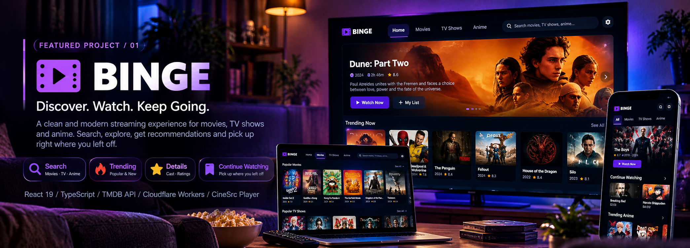
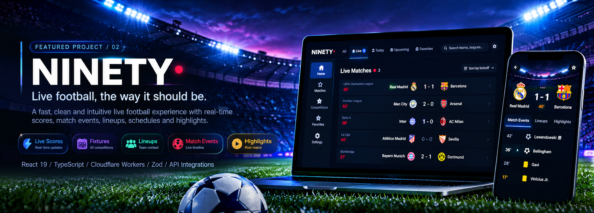
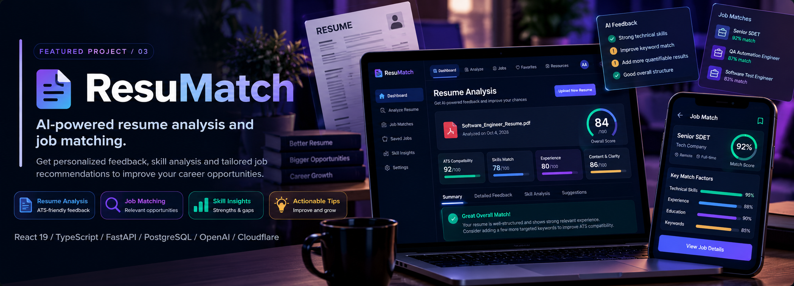
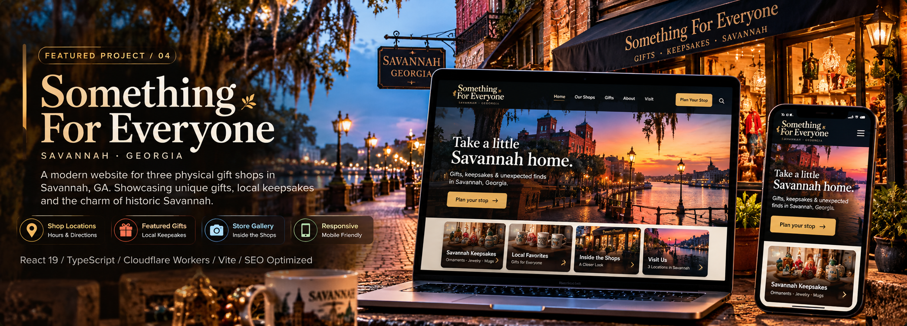
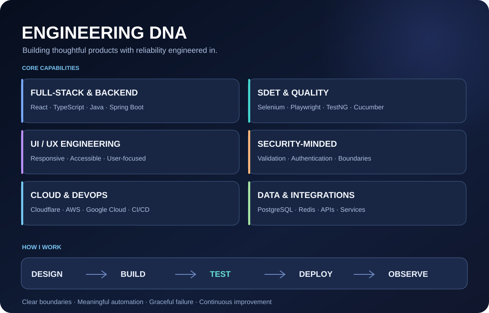

### Software engineering · Quality engineering · Product design

I build dependable software, thoughtful user experiences, and automated quality checks — from backend integrations to cloud-deployed applications.

## About me

I'm a software engineer working across **full-stack development, backend services, SDET, and cloud delivery**. I build user-focused products with clear integration boundaries, automated quality checks, and resilient behavior.

## Featured work

### 🎬 [BINGE](https://github.com/AnamolAdhikari/binge) · Media discovery experience

A personal movie, TV, and anime experience built around fast discovery, rich title and cast pages, search, personal lists, and continue-watching journeys.

**Engineering focus:** Component-driven UI · Persistent product state · Responsive interactions · Edge deployment

**Stack:** React 19 · TypeScript · Vite · Cloudflare Workers · TMDB-backed metadata

  

<strong>Additional BINGE screenshots — full-size gallery</strong>

  

  

  

  

  

  

### ⚽ [NINETY](https://github.com/AnamolAdhikari/Ninety) · Football matchday experience

A football application for the full match journey — discovering fixtures, following live match context, and exploring events, lineups, and post-match information.

**Engineering focus:** Match lifecycle states · Defensive data validation · Fallback UX · Edge deployment

**Stack:** TypeScript · React 19 · Vinext/Vite · Cloudflare Workers · Zod · Node-based tests

<strong>Additional NINETY screenshots — full-size gallery</strong>

  

  

<strong>Explore NINETY engineering diagrams</strong>

See the [architecture](https://github.com/AnamolAdhikari/Ninety#architecture) and [match lifecycle](https://github.com/AnamolAdhikari/Ninety#match-lifecycle) diagrams in the project README.

### 🤖 [ResuMatch](https://github.com/AnamolAdhikari/ResuMatch) · Resume analysis with NLP

An ATS-oriented resume analysis tool that compares resumes with job descriptions, identifies gaps, and suggests improvements.

**Stack:** Python · Streamlit · NLP · spaCy · sentence-transformers

  

<strong>Original ResuMatch application screenshot</strong>

  

The cinematic banner is illustrative; features, metrics, and technologies pictured are not necessarily implemented in the repository.

### 🛍️ [Something For Everyone](https://github.com/AnamolAdhikari/something-for-everyone) · Savannah business website

A responsive, design-led website for a Savannah gift-shop business, with emphasis on local discovery, accessibility, visual storytelling, and performance.

**Focus:** TypeScript · Responsive UI · Accessibility · SEO · Cloud deployment

  

[Explore the repository →](https://github.com/AnamolAdhikari/something-for-everyone)

---

## Engineering DNA

  

<strong>Explore the full technology toolbox and engineering approach</strong>

The tools below span professional engineering work, personal projects, and continued learning; they are not all deployed in every featured application.

**Languages & frameworks:** Java · Python · TypeScript · JavaScript · React · Spring Boot · FastAPI · Node.js

**Testing & quality:** Selenium · Playwright · TestNG · Cucumber · Postman · Regression and API checks

**Cloud & infrastructure:** AWS · Google Cloud · Cloudflare · Docker · Kubernetes · Terraform · Linux

**Delivery & observability:** Jenkins · GitHub Actions · Git · Maven · Gradle · Grafana · Datadog

**Data & development:** PostgreSQL · SQLite · Redis · VS Code · IntelliJ IDEA

**Engineering approach:** Validate external data, automate critical journeys, make failure states understandable, keep changes reviewable, and improve delivery and observability over time.

## Engineering highlights

Beyond the interfaces, these projects demonstrate how I approach building and maintaining software:

- **[Lifecycle-aware application design · NINETY](https://github.com/AnamolAdhikari/Ninety#match-lifecycle)** — Models upcoming, live, and completed matches as distinct states, with defensive handling of delayed or incomplete data.
- **[Architecture & integration boundaries · NINETY](https://github.com/AnamolAdhikari/Ninety#architecture)** — Documents the separation between the user interface, application logic, and external integrations.
- **[Product state & cloud delivery · BINGE](https://github.com/AnamolAdhikari/binge)** — Uses React and TypeScript with Cloudflare deployment and documented profile-aware viewing state.
- **[Automated build checks · Something For Everyone](https://github.com/AnamolAdhikari/something-for-everyone/blob/main/.github/workflows/ci.yml)** — GitHub Actions workflow configured for linting, TypeScript checks, and production builds.

Highlights describe repository-documented implementations and configured workflows; they do not imply unverified test coverage or deployment success.

## GitHub activity

[View contributions and activity](https://github.com/AnamolAdhikari?tab=overview) · [Browse all repositories](https://github.com/AnamolAdhikari?tab=repositories)

## More projects

| Repository | Area |
| --- | --- |
| [Terraform Study](https://github.com/AnamolAdhikari/terraform_study) | Infrastructure as Code learning |
| [ChatApp](https://github.com/AnamolAdhikari/ChatApp) | Java application development |
| [To-Do List Django](https://github.com/AnamolAdhikari/To-Do-List-Django) | Django and CRUD workflows |
| [TicTacToe](https://github.com/AnamolAdhikari/TicTacToe) | Android / Kotlin |
| [Portfolio](https://github.com/AnamolAdhikari/anamoladhikari.github.io) | Frontend portfolio work |

---

### Build useful things. Test what matters. Keep improving.

[**BINGE**](https://github.com/AnamolAdhikari/binge) · [**NINETY**](https://github.com/AnamolAdhikari/Ninety) · [**All repositories**](https://github.com/AnamolAdhikari?tab=repositories)

