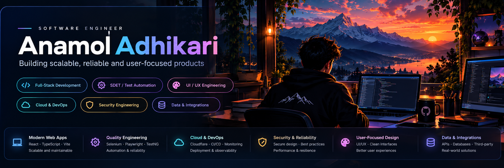

<div align="center">



### Software engineering · Quality engineering · Product design

I build dependable software, thoughtful user experiences, and automated quality checks — from backend integrations to cloud-deployed applications.

[](https://github.com/AnamolAdhikari/binge)
[](https://github.com/AnamolAdhikari/Ninety)
[](https://github.com/AnamolAdhikari?tab=repositories)

</div>

## About me

I'm a software engineer focused on **full-stack development, backend services, software testing, and cloud delivery**. I enjoy turning ideas into usable applications, designing resilient integrations, and making software easier to test, operate, and improve.

My approach combines **engineering discipline** with **product thinking**: understandable interfaces, clear system boundaries, meaningful tests, and graceful behavior when something goes wrong.

## Featured work

### 🎬 [BINGE](https://github.com/AnamolAdhikari/binge) · Media discovery experience

A personal movie, TV, and anime experience built around fast discovery, rich title and cast pages, search, personal lists, and continue-watching journeys.

**Engineering focus:** Component-driven UI · Persistent product state · Responsive interactions · Edge deployment

**Stack:** React 19 · TypeScript · Vite · Cloudflare Workers · TMDB-backed metadata

<p align="center">
  <a href="https://github.com/AnamolAdhikari/binge"></a>
</p>

<details>
<summary><strong>Additional original BINGE screenshots</strong></summary>
<p align="center">
  
  
  
  
</p>
</details>

### ⚽ [NINETY](https://github.com/AnamolAdhikari/Ninety) · Football matchday experience

A football application for the full match journey — discovering fixtures, following live match context, and exploring events, lineups, and post-match information.

**Engineering focus:** Match lifecycle states · Defensive data validation · Fallback UX · Edge deployment

**Stack:** TypeScript · React 19 · Vinext/Vite · Cloudflare Workers · Zod · Node-based tests

<!-- NINETY showcase: two existing screenshots, no new binary asset required. -->
<table>
  <tr>
    <td colspan="2" align="center">
      <a href="https://github.com/AnamolAdhikari/Ninety"><strong>NINETY · LIVE FOOTBALL, BUILT AROUND THE MATCH</strong></a><br />
      Fixtures &nbsp;·&nbsp; Live context &nbsp;·&nbsp; Events &nbsp;·&nbsp; Lineups
    </td>
  </tr>
  <tr>
    <td width="62%" align="center"><a href="https://github.com/AnamolAdhikari/Ninety"></a></td>
    <td width="38%" align="center"><a href="https://github.com/AnamolAdhikari/Ninety"></a></td>
  </tr>
</table>

<details>
<summary><strong>Explore NINETY engineering diagrams</strong></summary>

See the [architecture](https://github.com/AnamolAdhikari/Ninety#architecture) and [match lifecycle](https://github.com/AnamolAdhikari/Ninety#match-lifecycle) diagrams in the project README.

</details>

### 🤖 [ResuMatch](https://github.com/AnamolAdhikari/ResuMatch) · Resume analysis with NLP

An ATS-oriented resume analysis tool that compares resumes with job descriptions, identifies gaps, and suggests improvements.

**Stack:** Python · Streamlit · NLP · spaCy · sentence-transformers

<p align="center">
  <a href="https://github.com/AnamolAdhikari/ResuMatch"></a>
</p>

### 🛍️ [Something For Everyone](https://github.com/AnamolAdhikari/something-for-everyone) · Savannah business website

A responsive, design-led website for a Savannah gift-shop business, with emphasis on local discovery, accessibility, visual storytelling, and performance.

**Focus:** TypeScript · Responsive UI · Accessibility · SEO · Cloud deployment

[Explore the repository →](https://github.com/AnamolAdhikari/something-for-everyone)

---

## Engineering expertise

| Focus | What I work on |
| --- | --- |
| **Full-stack & backend** | React, TypeScript, Java, Spring Boot, Python, FastAPI, Node.js, API integrations |
| **SDET & quality** | Selenium, Playwright, TestNG, Cucumber, Postman, automated checks, regression coverage |
| **UI/UX engineering** | Responsive layouts, accessible interfaces, interaction design, error and empty states |
| **Security-minded engineering** | Input validation, safe integration boundaries, authentication-aware application design |
| **Cloud & DevOps** | Cloudflare Workers, AWS, Google Cloud, Docker, Kubernetes, Terraform, Linux |
| **Data & integrations** | PostgreSQL, SQLite, Redis, service interfaces, defensive data handling |

<details>
<summary><strong>Full technology toolbox</strong></summary>

The tools below span professional engineering work, personal projects, and continued learning; they are not all deployed in every featured application.

**Languages & frameworks:** Java · Python · TypeScript · JavaScript · React · Spring Boot · FastAPI · Node.js

**Cloud & infrastructure:** AWS · Google Cloud · Cloudflare · Docker · Kubernetes · Terraform · Linux

**Delivery & observability:** Jenkins · GitHub Actions · Git · Maven · Gradle · Grafana · Datadog

**Testing:** Selenium · Playwright · TestNG · Cucumber · Postman

**Data & development:** PostgreSQL · SQLite · Redis · VS Code · IntelliJ IDEA

</details>

## How I engineer software

```text
Understand the problem
        ↓
Design clear boundaries
        ↓
Build & validate
        ↓
Automate critical tests
        ↓
Deploy & observe
        ↓
Improve from feedback
```

**Reliability first.** Validate external data, make failures understandable, and treat edge cases as part of the product rather than afterthoughts.

**Test what matters.** Focus automated coverage on critical user journeys, service contracts, and regression risks. Use the right level of testing for the behavior being checked.

**Deliver thoughtfully.** Keep changes reviewable, make deployment repeatable, and improve observability as systems evolve.

## GitHub activity

Explore my [contributions](https://github.com/AnamolAdhikari?tab=overview) and [repositories](https://github.com/AnamolAdhikari?tab=repositories). I prefer linking to GitHub's native activity view rather than displaying potentially stale third-party statistics.

## More projects

| Repository | Area |
| --- | --- |
| [Terraform Study](https://github.com/AnamolAdhikari/terraform_study) | Infrastructure as Code learning |
| [ChatApp](https://github.com/AnamolAdhikari/ChatApp) | Java application development |
| [To-Do List Django](https://github.com/AnamolAdhikari/To-Do-List-Django) | Django and CRUD workflows |
| [TicTacToe](https://github.com/AnamolAdhikari/TicTacToe) | Android / Kotlin |
| [Portfolio](https://github.com/AnamolAdhikari/anamoladhikari.github.io) | Frontend portfolio work |

<div align="center">

---

### Build useful things. Test what matters. Keep improving.

[**BINGE**](https://github.com/AnamolAdhikari/binge) · [**NINETY**](https://github.com/AnamolAdhikari/Ninety) · [**All repositories**](https://github.com/AnamolAdhikari?tab=repositories)

</div>
