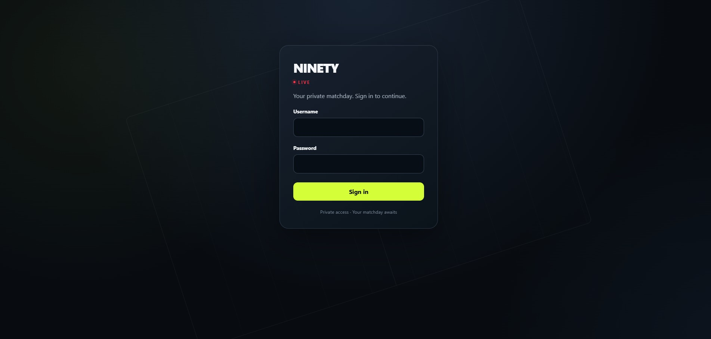
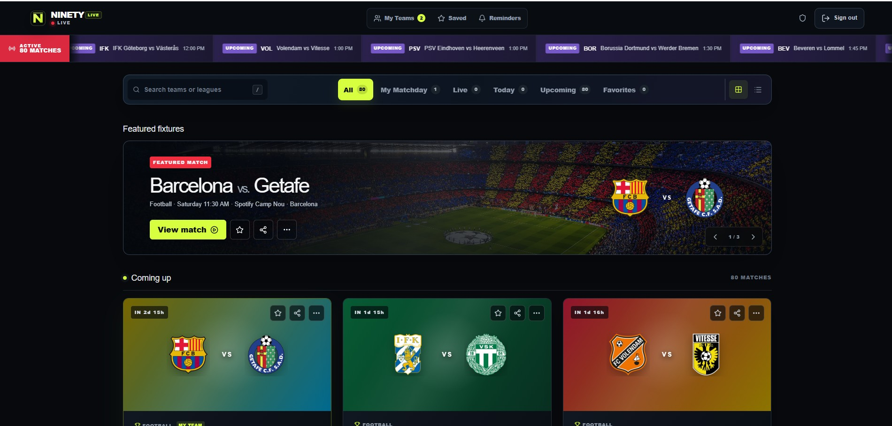
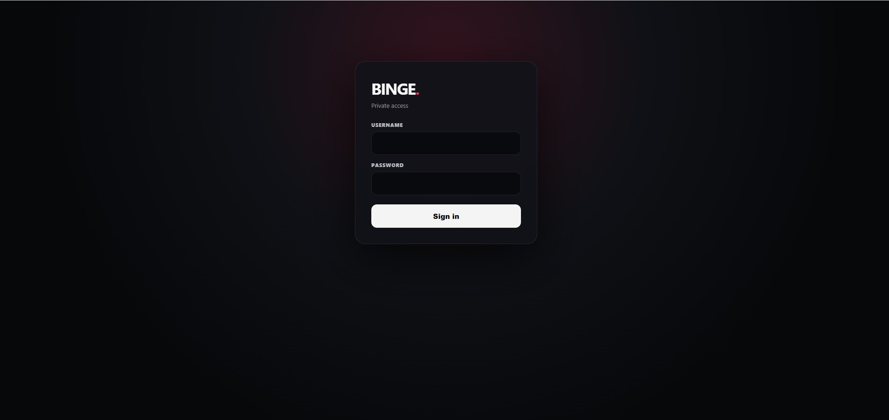
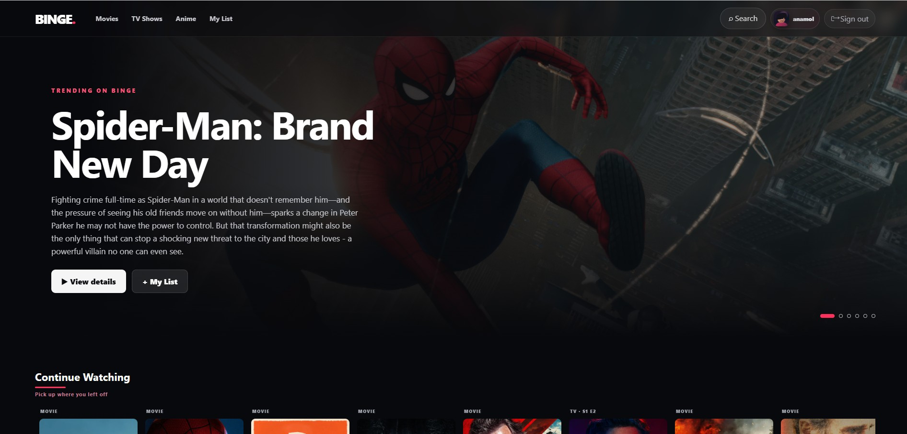
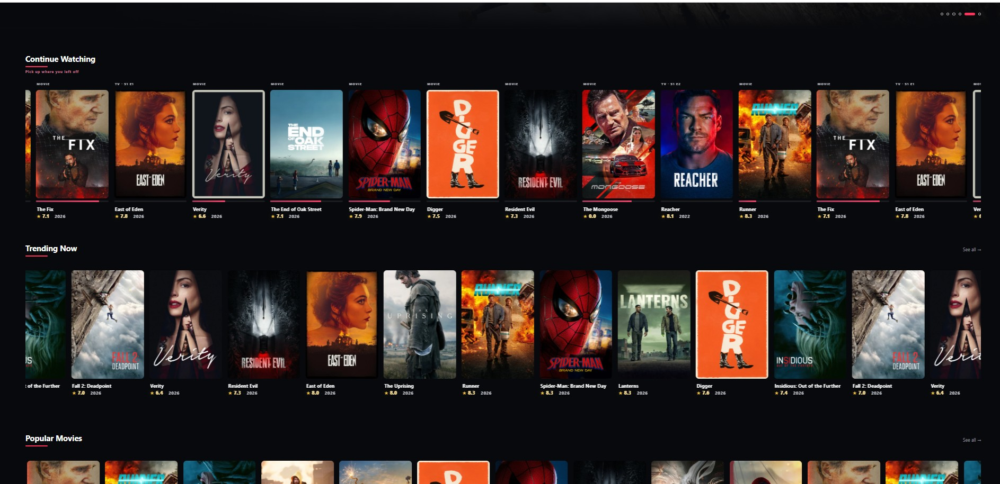
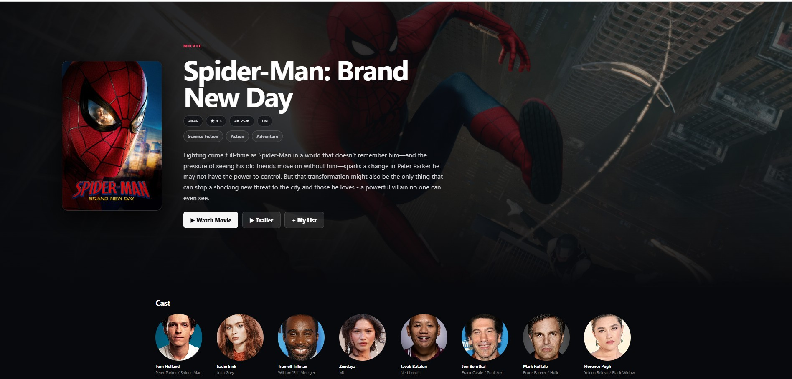
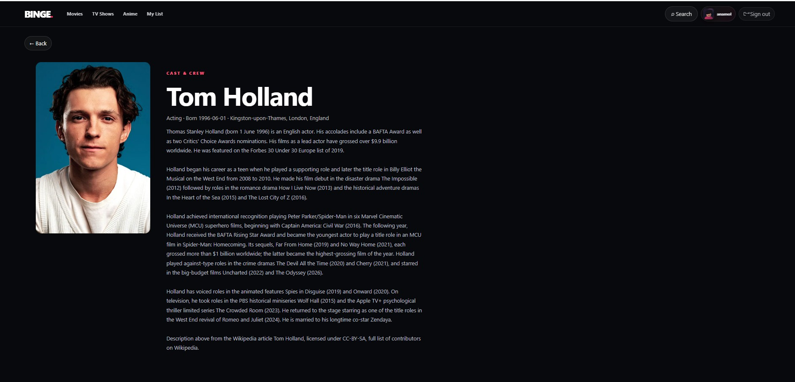
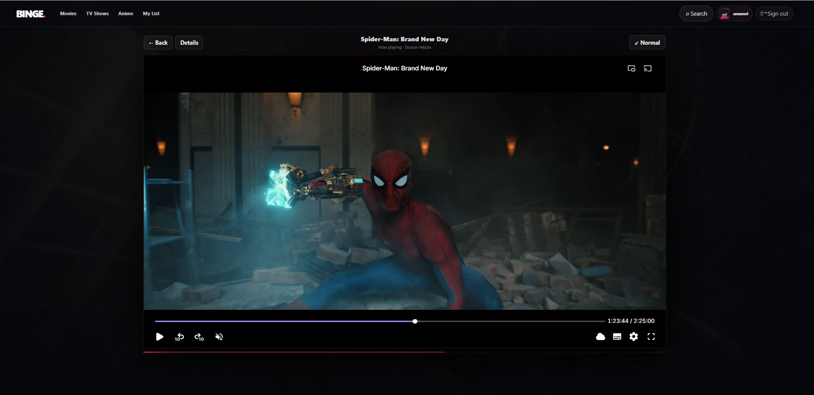

# Hi, I'm Anamol Adhikari 👋

### Software Engineer · Builder

I build reliable web products, automation-heavy systems, and applied AI projects — with a focus on turning messy real-world problems into software that feels simple to use.

---

## 🚀 Featured projects

### ⚽ [NINETY](https://github.com/AnamolAdhikari/Ninety) · Active development

A modern football matchday application built around the full fixture journey — upcoming, live, finished, and post-match. It focuses on resilient match-state handling, match events, lineups, saved matches, reminders, responsive UX, and graceful failure states.

**Stack:** TypeScript · React 19 · Vite/Vinext · Cloudflare Workers · Zod

> Built as a complete product rather than a static sports-data demo: state changes, unreliable dependencies, recovery behavior, and mobile/desktop UX are first-class concerns.

  

  

---

### 🤖 [ResuMatch](https://github.com/AnamolAdhikari/ResuMatch) · AI / NLP

An AI-powered ATS resume analysis tool that compares a resume with a job description, calculates an ATS compatibility score, surfaces missing keywords, and provides actionable improvement suggestions.

  

**Stack:** Python · Streamlit · NLP · spaCy · sentence-transformers · Hugging Face

---

### 🎬 BINGE · Private product project

A personal movie, TV, and anime discovery experience with a polished streaming-style interface. The project explores content discovery, cast pages, search, continue-watching state, responsive interactions, authentication, and a cleaner viewing experience.

**Focus:** consumer product UX · media discovery · state persistence · responsive design · authentication

  

  
  

  
  
  

---

### 🛍️ Something For Everyone · Private client-style build

A premium web experience for a Savannah gift-shop business, designed as the first phase of a broader digital storefront. The work emphasizes visual storytelling, responsive design, location discovery, accessibility, performance, and SEO-ready structure.

**Focus:** TypeScript · responsive UI · accessibility · SEO · product design

---

## 🧪 Other engineering work

| Project | What it explores |
| --- | --- |
| 🏗️ [Terraform Study](https://github.com/AnamolAdhikari/terraform_study) | Infrastructure as Code, Terraform workflows, state, modules, and cloud infrastructure concepts |
| 💬 [ChatApp](https://github.com/AnamolAdhikari/ChatApp) | Java application development and chat/client communication concepts |
| ✅ [To-Do List Django](https://github.com/AnamolAdhikari/To-Do-List-Django) | Django web application fundamentals and everyday CRUD-style product behavior |
| 📱 [TicTacToe](https://github.com/AnamolAdhikari/TicTacToe) | Android application development with Kotlin |
| 🌐 [Portfolio](https://github.com/AnamolAdhikari/anamoladhikari.github.io) | Earlier frontend work and personal portfolio development |
| 🧮 [Calculator](https://github.com/AnamolAdhikari/Calculator) | Foundational application logic and UI work |

---

## 🧰 Engineering toolbox

I work across backend engineering, API integration, automated testing, CI/CD, responsive frontend development, cloud/edge deployment, data-driven applications, and applied machine learning.

---

## 🧭 How I build

I care about more than the happy path. The projects I enjoy most have changing state, unreliable dependencies, real users, and edge cases that force good engineering decisions.

**Design the state → isolate integrations → validate inputs → fail gracefully → test critical behavior → ship → observe → improve.**

---

### Building software that survives the real world — not just the demo.

