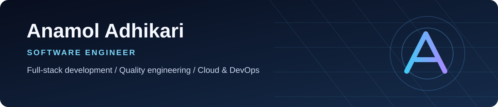
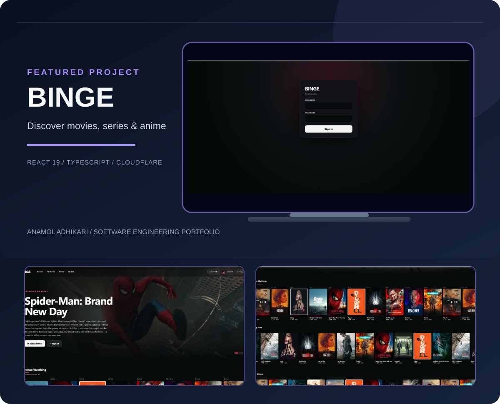

Building reliable applications, intuitive interfaces, and automation that makes software easier to ship and maintain.

## About & focus

I'm a software engineer working across **full-stack development, backend services, test automation, and cloud deployments**. I enjoy taking products from early prototypes to responsive, reliable applications — with particular attention to edge cases, performance, and maintainability.

**What matters to me:** Clear architecture · Practical automation · Resilient integrations · Thoughtful product design

---

## Featured projects

### 🎬 [BINGE](https://github.com/AnamolAdhikari/binge) — Media discovery experience

A personal movie, TV, and anime interface designed around fast discovery, rich title and cast pages, search, personal lists, and continue-watching experiences.

**Engineering highlights:** Component-driven UI · Persistent product state · Responsive interactions · Cloudflare deployment

**Stack:** React 19 · TypeScript · Vite · Cloudflare Workers · TMDB-backed metadata

  

<strong>Additional original BINGE screenshots</strong>

  
  
  
  

### ⚽ [NINETY](https://github.com/AnamolAdhikari/Ninety) — Football matchday experience

A football application built around the full match journey: upcoming fixtures, live match context, events, lineups, and post-match information.

**Engineering highlights:** Lifecycle-aware UI · Defensive data handling · Graceful fallback states · Edge deployment

**Stack:** TypeScript · React 19 · Vinext/Vite · Cloudflare Workers · Zod · Node-based tests

  

<strong>More NINETY screenshots</strong>

  

See the <a href="https://github.com/AnamolAdhikari/Ninety#architecture">architecture</a> and <a href="https://github.com/AnamolAdhikari/Ninety#match-lifecycle">match lifecycle</a> diagrams in the project README.

### 🤖 [ResuMatch](https://github.com/AnamolAdhikari/ResuMatch) — Resume analysis with NLP

An ATS-oriented resume analysis tool that compares resumes with job descriptions, identifies gaps, and suggests improvements.

**Stack:** Python · Streamlit · NLP · spaCy · sentence-transformers

  

### 🛍️ [Something For Everyone](https://github.com/AnamolAdhikari/something-for-everyone) — Savannah business website

A responsive, design-led website for a Savannah gift-shop business, with emphasis on local discovery, accessibility, visual storytelling, and performance.

**Focus:** TypeScript · Responsive UI · Accessibility · SEO · Cloud deployment

[Explore the repository →](https://github.com/AnamolAdhikari/something-for-everyone)

---

## 🧰 Engineering toolbox

Technologies from my engineering work, personal projects, and continued learning. Not every tool listed is deployed in the featured applications.

### Languages & frameworks

### Cloud & infrastructure

### DevOps & delivery

### Testing & quality

### Data & tooling

---

## Engineering approach

**Design for real-world behavior.** Keep integration boundaries clear, validate data, test critical paths, and make failures understandable. Use CI/CD and observability to improve the system as it evolves.

`Plan → Build → Test → Deploy → Observe → Improve`

---

## More projects

| Repository | Area |
| --- | --- |
| [Terraform Study](https://github.com/AnamolAdhikari/terraform_study) | Infrastructure as Code learning |
| [ChatApp](https://github.com/AnamolAdhikari/ChatApp) | Java application development |
| [To-Do List Django](https://github.com/AnamolAdhikari/To-Do-List-Django) | Django and CRUD workflows |
| [TicTacToe](https://github.com/AnamolAdhikari/TicTacToe) | Android / Kotlin |
| [Portfolio](https://github.com/AnamolAdhikari/anamoladhikari.github.io) | Frontend portfolio work |

---

**Build useful things. Test what matters. Keep improving.**

[All repositories](https://github.com/AnamolAdhikari?tab=repositories)

